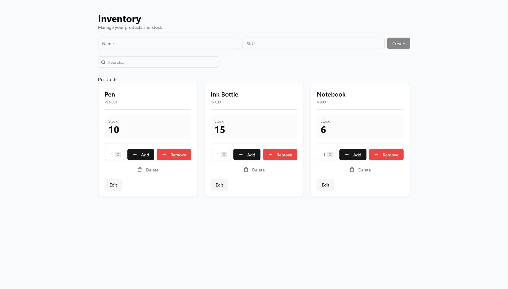

# Inventory Management System

## 🧭 Project Overview

This project simulates a real-world inventory management workflow, allowing users to manage products and track stock through movement-based updates.

It was built with a focus on clean architecture, data consistency, and responsive user experience.


## 🚀 Features

* Full CRUD operations for products
* Inventory tracking using movement-based system (stock in/out)
* Real-time stock calculation and updates
* Instant search by product name or SKU
* Responsive and modern UI with interactive feedback


## 📋 Requirements

### ✅ Functional Requirements (FRs)

* **FR1:** Users can create new products with a name and SKU
* **FR2:** Users can view a list of all products
* **FR3:** Users can search products by name or SKU
* **FR4:** Users can update product information (name and SKU)
* **FR5:** Users can delete products
* **FR6:** Users can record inventory movements (stock in and stock out)
* **FR7:** Users can view the current stock level for each product
* **FR8:** The system prevents stock from going below zero

---

### ⚙️ Non-Functional Requirements (NFRs)

* **NFR1:** The system should respond to user actions within 1 second under normal conditions
* **NFR2:** The UI should be responsive and usable on different screen sizes
* **NFR3:** The system should ensure data consistency using relational constraints (PostgreSQL + Prisma)
* **NFR4:** The backend should handle concurrent requests safely
* **NFR5:** The frontend should provide immediate feedback for user actions (toasts, loading states)
* **NFR6:** The system should handle invalid input gracefully with proper validation (Zod)
* **NFR7:** The application should be modular and maintainable (separation of concerns)
* **NFR8:** The system should support scalability through a structured API and database design

## 🔌 API Overview

### Products

* `GET /products` → List all products
* `POST /products` → Create a new product
* `PUT /products/:id` → Update a product
* `DELETE /products/:id` → Delete a product

### Inventory

* `POST /inventory/movement` → Create stock movement (IN/OUT)
* `GET /products/:id/stock` → Get current stock for a product


## 🧩 System Design Highlights

### 🏗️ Architecture

The application follows a **client-server architecture**:

* **Frontend (React + Vite):** Handles UI, state management, and user interactions
* **Backend (Fastify):** Exposes RESTful APIs and handles business logic
* **Database (PostgreSQL):** Stores persistent data with relational integrity

---

### 🔄 State Management & Data Fetching

* Uses **React Query** for:

  * Server state synchronization
  * Automatic caching and revalidation
  * Optimistic UI updates
* Reduces unnecessary API calls and improves responsiveness

---

### 🗃️ Database Design

* Relational structure with two main entities:

  * `Product`
  * `InventoryMovement`
* Enforces **data integrity** through foreign key constraints
* Prevents invalid operations (e.g., deleting products with dependencies without handling relations)

---

### ⚙️ Backend Structure

* Modular design:

  * **Routes** → define API endpoints
  * **Controllers** → handle requests/responses
  * **Services** → contain business logic
* Ensures separation of concerns and maintainability

---

### ✅ Validation & Error Handling

* Uses **Zod** for request validation
* Ensures:

  * Correct data types
  * Required fields
  * Safe input handling
* Errors are handled gracefully and returned with meaningful messages

---

### 🎨 UI & Component Design

* Built with **shadcn/ui + Tailwind CSS**
* Emphasis on:

  * Reusable components
  * Consistent styling
  * Clear visual hierarchy

---

### 🔒 Data Consistency

* Stock is calculated from **inventory movements**, not stored directly
* Prevents:

  * Data desynchronization
  * Invalid stock states

---

### 🚀 Scalability Considerations

* Clear API structure allows easy extension (e.g., authentication, pagination)
* Modular frontend enables feature expansion without major refactoring
* Database design supports growth with additional relations and queries

## 🛠️ Tech Stack

### Frontend

* React
* TypeScript
* Vite
* Tailwind CSS
* shadcn/ui
* React Query

### Backend

* Node.js
* Fastify
* Prisma ORM
* PostgreSQL

## 📁 Project Structure

```bash
frontend/
  src/
    components/
    features/products/
    lib/

backend/
  src/
    modules/products/
    modules/inventory/
    lib/
```


## 📦 How to Run

### Backend

```bash
cd backend
npm install
npm run dev
```

### Frontend

```bash
cd frontend
npm install
npm run dev
```

## 📸 Screenshots



## 📚 What I Learned

* Designing and implementing a full-stack CRUD system
* Managing server state effectively with React Query
* Structuring scalable backend modules (routes, controllers, services)
* Handling real-world issues such as CORS, validation, and relational constraints
* Building UI with reusable and composable components


## 📌 Future Improvements

* Authentication (login system)
* Pagination
* Dark mode
* Advanced filtering

---

💡 *This project reflects my approach to building scalable, maintainable, and user-focused applications.*
